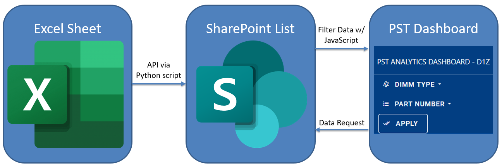
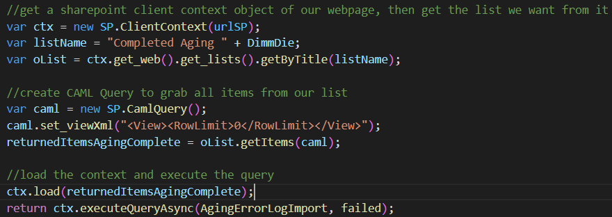

# PST Data Analytics Dashboard

## Authors
- Charles Oh
- Riley Wilkins

## Overview
PST (Pre-screening Test) data analytics dashboard automatically extracts data from Excel sheets with PST results, transfers data into MySQL database, and generates data analysis and visualizations on Sharepoint.

## Dashboard Functionalities

1. DIMM Type/Part Number: Selection of DIMM type and part number(s)
2. Product History: Pre-screening test log by date for selected products
3. Selected Parts Information: Total count, avg. failure rate, avg. TTF for selected products
4. Failure Rate Comparison: PST failure rate comparison for selected products
5. DIMM Quantity Proportion by Customers: Customer breakdown for selected products

## Tech Stack 
- Backend: Python 
- Database: SQLite 
- Frontend: Javascript, CSS, HTML
- Libraries: Chart.js, jQuery, lxml

## Moving Data from Excel to Sharepoint

The general flow of data is as seen above. A python script converts the entries from excel worksheets to a .db file. This .db file is then converted to a sharepoint list using a mixture of the SOAP and REST APIs provided by sharepoint.

In order for an user to run the aforementioned python script, they should simply run `python3 xlsx2SPlist.py` in their terminal with the `SPlist.py` file in the same working directory.

Note that two things need to be set in order for this to work. The first is that the `workdir` variable in `xlsx2SPlist.py` should be set to point to a directory that contains `settings.cfg` and the .xlsx files to be converted to sharepoint.

Secondly, the user should change the above variables in the `settings.cfg` to match the specifications below:
- username: sharepoint username without email extension
- password: sharepoint password
- workdir: same work directory used earlier to point to location of excel files
- urlSP: url of the sharepoint website to upload files to. This url should point to the root of the sharepoint website, such as sharepoint.com/biz/websiteName
- xlsxName: name of .xlsx file that contains the D1x/D1y/D1z sheets
- dbName: name of output .db file
- xlsxNameLog: name of .xlsx file that contains the aging error log sheet.
- wsNames: names of all excel work sheets to be uploaded to sharepoint, such as D1x/D1y/D1z and aging error log.

Note that there is no need to worry about duplicate/garbage data entries being added to sharepoint, as `xlsx2SPlist.py` automatically filters these out.

## Visualing data through Sharepoint
Two steps are taken when a user requests data from the PST dashboard:
- javascript sends a CAML query to the sharepoint API to request data
- Once executed, javascript processes the data and inserts it into the tables/graphs/etc. of the PST dashboard.

Above is an example of a simple CAML query used to request data from sharepoint. We simply get the list by its list name, and then send a CAML query to select all items of the list using the `getItems` function. Afterwards, we execute the query asynchronously. If successful, `AgingErrorLogImport` will be ran, which will process the data so that it can be used in the dashboard.

## Impact
1. With analyzed PST data, DSA can provide product quality feedback to DSK 
**-> Increased product quality**
2. Ownership of analyzed PST data will decrease customer management turnaround time by three weeks 
**-> Increased customer satisfaction** 

   **--> Combination of 1 and 2 will lead to a faster qualification of new DIMM products.**
